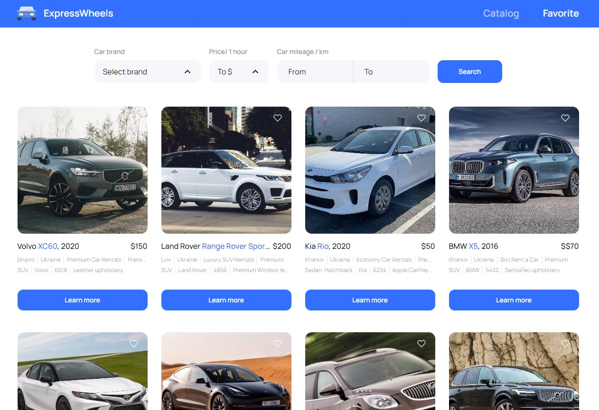

# Rent cars

Welcome to Rent cars! This is a sample project showcasing a car rental
application.

## Overview

Rent cars is a React-based web application that allows users to browse
a catalog of cars, view car details, add cars to their favorites, and search for
specific cars based on filters.

## Live Demo

Check out the live demo:
[Rent cars](https://luzhnyak.github.io/rent-cars)

## Features

- Browse a catalog of cars
- View detailed information about each car
- Add cars to favorites
- Search for cars based on filters (make, price, mileage)

## Technologies Used

`JavaScript` `React` `ReduxToolkit` `ReduxPersist` `Axios` `HTML/CSS`
`MockAPI for data` `React router dom`

## Installation

To run the project locally, follow these steps:

1. Clone the repository:

   `git clone https://github.com/luzhnyak/rent-cars.git`

2. Navigate to the project directory:

   `cd rent-cars`

3. Install dependencies:

   `npm install`

4. Start the development server:

   `npm run start`

5. Open your browser and visit http://localhost:5173 to view the application.

## Deployment

The project is deployed using GitHub Pages. The deployment process involves
building the React application and configuring GitHub Pages to serve the built
assets from the gh-pages branch.

To deploy the application to GitHub Pages:

1. Make sure you have set up your GitHub repository with the correct settings
   for GitHub Pages deployment.

2. Run the following command to build the application:

'npm run build'

3. Once the build process is complete, commit and push the changes to your
   GitHub repository.

4. GitHub Pages will automatically deploy the application, and it will be
   accessible at https://<username>.github.io/rent-cars.

## Contributing

Contributions are welcome! If you find any bugs or have suggestions for
improvements, please open an issue or submit a pull request.